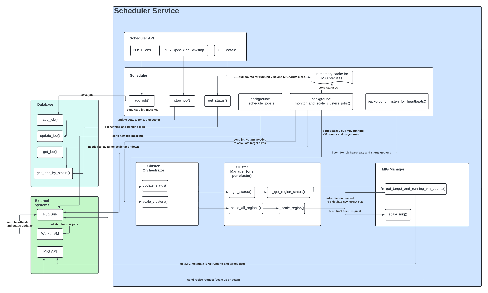

# Pipeline Zen Jobs Scheduler

Pipeline Zen Jobs Scheduler is a robust system designed to manage and scale compute resources for job processing across multiple clusters and regions in Google Cloud Platform (GCP). This system optimizes the allocation and utilization of GPU resources, significantly reducing wait times for computational jobs and ensuring efficient resource usage.

## Project Purpose

The Pipeline Zen Jobs Scheduler addresses the challenges of GPU resource management in cloud environments where availability can be limited or unpredictable. By implementing a multi-region approach, the system:

- Enables efficient sourcing of GPUs from various geographical locations
- Reduces wait times for GPU resources, ensuring prompt job starts
- Implements automatic scaling of Managed Instance Groups (MIGs)
- Dynamically adjusts the number of GPU instances based on workload demands
- Optimizes resource usage and cost-efficiency

This intelligent scaling mechanism provides the right amount of computational power when and where it's needed most, offering a robust solution for organizations requiring flexible, responsive, and efficient management of GPU resources for their computational workloads.

## System Architecture

The system is composed of several key components that work together to manage jobs and scale resources:

1. **Scheduler**: The central component that manages the overall job scheduling process, interacts with the database, coordinates with the ClusterOrchestrator, uses PubSub for messaging, and periodically monitors and updates the system state.

2. **ClusterOrchestrator**: Oversees all clusters in the system, maintaining a collection of ClusterManagers, coordinating scaling operations across all clusters, and aggregating status information.

3. **ClusterManager**: Responsible for a specific cluster configuration, managing operations across multiple regions, handling scaling decisions, and interacting with the MigManager.

4. **MigManager**: Directly interacts with Google Cloud's Managed Instance Groups (MIGs), performing API calls to scale MIGs, get MIG information, and list VMs.

5. **PubSub Client**: Facilitates asynchronous communication within the system, publishing messages about new jobs, listening for heartbeat messages, and sending stop signals to running jobs.

6. **Database**: Manages job tracking and persistence using PostgreSQL.

## High Level System Design Diagram

[High Level System Design](https://lucid.app/lucidchart/effc926c-26d1-460b-af9d-fe2eabf55916/edit?viewport_loc=-1696%2C-213%2C4240%2C2302%2C0_0&invitationId=inv_10f2be83-f8dd-4e42-9c84-16cdbf2251b5)

## Key Terminology

- **Cluster**: A logical grouping of compute resources with similar specifications (e.g., "4xa100-40gb" for a cluster of machines with 4 A100 40GB GPUs each).
- **Region**: A geographic area where GCP resources can be located (e.g., "us-central1").
- **MIG (Managed Instance Group)**: A GCP resource that maintains a group of identical VM instances, allowing for easy scaling and management.
- **VM (Virtual Machine)**: An individual compute instance within a MIG.
- **Job**: A unit of work that needs to be processed on the compute resources.
- **Scaling**: The process of adjusting the number of VMs in a MIG based on workload demands.
- **PubSub**: Google Cloud Pub/Sub, a messaging service used for sending and receiving messages between components.

## Workflow

1. The Scheduler receives a new job request.
2. The job is added to the database and a message is published via PubSub to start the job.
3. The Scheduler determines which cluster should handle the job based on its requirements.
4. The ClusterOrchestrator is notified to check if scaling is necessary.
5. If scaling is needed, the appropriate ClusterManager uses the MigManager to adjust the size of the relevant MIGs.
6. The job starts running on an available VM.
7. The running job sends periodic heartbeat messages via PubSub, which the Scheduler uses to update the job status.
8. The Scheduler continues to monitor running jobs and pending workloads, adjusting resources as needed.
9. When a job completes or needs to be stopped, the Scheduler sends a message via PubSub to the relevant VM.

## Configuration

The system is configured with:

- A list of available clusters and their specifications.
- The regions associated with each cluster.
- Maximum scale limits for each cluster.
- GCP project information and credentials.
- PubSub topic and subscription names for various message types.

This configuration allows the system to make informed decisions about resource allocation and scaling across different types of compute resources and geographic regions, while maintaining efficient communication between components.

## Data Flow

1. Job Requests → Scheduler → Database
2. Scheduler → PubSub → Job Start Messages
3. Running Jobs → PubSub → Heartbeat Messages → Scheduler
4. Scheduler → ClusterOrchestrator → ClusterManagers → MigManager → GCP (for scaling)
5. Scheduler → PubSub → Job Stop Messages (when needed)

## Getting Started

For instructions on how to set up and run the Pipeline Zen Jobs Scheduler, please refer to the [RUNME.md](RUNME.md) file.

For detailed usage instructions, including how to schedule jobs, monitor status, and interact with the system, please see the [USAGE.md](USAGE.md) file.